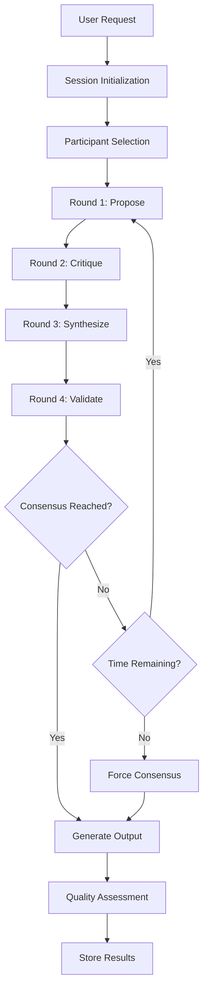

# True Multi-LLM Collaboration System

## Overview

The True Multi-LLM Collaboration System is a revolutionary approach to AI-powered development that enables multiple Large Language Models to work together meaningfully, producing superior results through genuine collaboration rather than simple task handoffs.

## Key Features

### 🤝 **True Collaboration**
- **Multi-round discussions** where LLMs build upon each other's ideas
- **Iterative refinement** through propose → critique → synthesize → validate cycles
- **Emergent intelligence** that exceeds individual LLM capabilities

### ⏱️ **Time-Bounded Intelligence**
- **Configurable time limits** (default: 5 minutes per session)
- **Progressive warnings** at 75% and 90% of time limit
- **Graceful timeout handling** with forced consensus mechanisms

### 🎯 **Intelligent Task Assignment**
- **LLM strength profiling** based on historical performance
- **Optimal task matching** (OpenAI: implementation, Anthropic: reasoning, Grok: creativity)
- **Cost-quality optimization** to balance token usage with output quality

### 🔒 **Quality Assurance Integration**
- **Multi-perspective code review** using specialized LLM assignments
- **Collaborative documentation** generation with comprehensive coverage
- **Distributed security analysis** leveraging different LLM strengths

## Architecture

### Core Components

```
┌─────────────────────────────────────────────────────────────────┐
│                    CollaborativeSessionManager                   │
│  ┌─────────────────┐  ┌─────────────────┐  ┌─────────────────┐ │
│  │   TimeManager   │  │ CollaborationRound│  │  EventSystem    │ │
│  │                 │  │                 │  │                 │ │
│  │ • Timer Control │  │ • Round Logic   │  │ • Event Emission│ │
│  │ • Warnings      │  │ • Contribution  │  │ • State Changes │ │
│  │ • Timeouts      │  │   Collection    │  │ • Error Handling│ │
│  └─────────────────┘  └─────────────────┘  └─────────────────┘ │
└─────────────────────────────────────────────────────────────────┘
                                  │
                                  │ Integrates with
                                  ▼
┌─────────────────────────────────────────────────────────────────┐
│                         LLMManager                              │
│  ┌─────────────────┐  ┌─────────────────┐  ┌─────────────────┐ │
│  │     OpenAI      │  │    Anthropic    │  │      Grok       │ │
│  │                 │  │                 │  │                 │ │
│  │ • Implementation│  │ • Reasoning     │  │ • Creativity    │ │
│  │ • Code Quality  │  │ • Logic         │  │ • Innovation    │ │
│  │ • Bug Detection │  │ • Security      │  │ • UX Design     │ │
│  └─────────────────┘  └─────────────────┘  └─────────────────┘ │
└─────────────────────────────────────────────────────────────────┘
```

### Collaboration Flow



## Getting Started

### Basic Usage

```typescript
import { CollaborativeSessionManager } from './src/collaboration/CollaborativeSessionManager';
import { LLMManager } from './src/llm/llmManager';
import { VectorDB } from './src/db/vectorDB';

// Initialize the collaboration system
const llmManager = new LLMManager();
const vectorDB = new VectorDB();
const collaborationManager = new CollaborativeSessionManager(llmManager, vectorDB);

// Create a collaboration request
const request = {
  prompt: "Design a secure user authentication system for a web application",
  priority: 'high',
  timeLimit: 300000, // 5 minutes
  consensusThreshold: 66, // 66% agreement required
  preferredParticipants: ['OpenAI', 'Anthropic', 'xAI'], // Optional
  constraints: [
    'Must support multi-factor authentication',
    'Must be GDPR compliant',
    'Must integrate with existing database'
  ]
};

// Start collaboration
const session = await collaborationManager.startSession(request);

// Listen for events
collaborationManager.on('session_completed', (event) => {
  console.log('Collaboration completed!');
  console.log('Quality Score:', event.data.session.output.qualityScore);
  console.log('Final Solution:', event.data.session.output.content);
});
```

### Advanced Configuration

```typescript
// Configure collaboration behavior
const advancedRequest = {
  prompt: "Optimize database queries for high-traffic e-commerce site",
  priority: 'critical',
  timeLimit: 600000, // 10 minutes for complex tasks
  consensusThreshold: 75, // Higher threshold for critical tasks
  maxRounds: 6, // Allow more rounds for complex problems
  qualityThreshold: 85, // Minimum quality score required
  costBudget: 10000, // Maximum tokens to spend
  
  // Custom participant configuration
  preferredParticipants: ['OpenAI', 'Anthropic'],
  
  // Task-specific constraints
  constraints: [
    'Must maintain backwards compatibility',
    'Performance improvement must be measurable',
    'Solution must be production-ready'
  ]
};
```

## Collaboration Rounds Explained

### Round 1: Propose 🌱
**Purpose**: Generate diverse initial approaches and ideas

**Process**:
- All participants receive the same prompt
- Each LLM proposes their solution independently
- Contributions focus on leveraging each LLM's unique strengths
- Time limit: 60 seconds

**Example Output**:
- **OpenAI**: Focuses on implementation details and code structure
- **Anthropic**: Emphasizes logical architecture and security considerations
- **Grok**: Suggests innovative approaches and user experience enhancements

### Round 2: Critique 🔍
**Purpose**: Provide constructive feedback and identify improvements

**Process**:
- Each LLM reviews all proposals from Round 1
- Identifies strengths, weaknesses, and potential issues
- Suggests specific improvements and alternatives
- Time limit: 45 seconds

**Benefits**:
- Catches errors and oversights
- Identifies conflicting approaches
- Highlights areas needing clarification

### Round 3: Synthesize 🔀
**Purpose**: Combine the best elements into a unified solution

**Process**:
- Most capable LLM (usually Anthropic) leads synthesis
- Incorporates feedback from critique round
- Resolves conflicts between different approaches
- Creates comprehensive solution combining best ideas
- Time limit: 90 seconds

**Result**: A unified solution that's better than any individual proposal

### Round 4: Validate ✅
**Purpose**: Final quality check and validation

**Process**:
- All participants except synthesizer review final solution
- Check against original requirements
- Identify any remaining issues or improvements
- Provide final recommendations
- Time limit: 30 seconds

**Outcome**: Validated, high-quality solution ready for implementation

## Quality Metrics

### Quantitative Measures
- **Quality Score**: 0-100 based on multiple factors
- **Consensus Level**: unanimous → qualified majority → simple majority → forced
- **Token Efficiency**: Quality score per token used
- **Time Efficiency**: Quality achieved within time limits

### Qualitative Indicators
- **Emergence Score**: Measure of solutions exceeding individual capabilities
- **Innovation Index**: Novel approaches and creative solutions
- **Completeness**: Coverage of all requirements and edge cases
- **Implementability**: Practical, actionable solutions

## Integration with AstraForge

### Enhanced LLMManager

The collaboration system extends the existing `LLMManager` with new methods:

```typescript
// New collaborative methods
await llmManager.startCollaborativeSession(request);
await llmManager.executeCollaborationRound(session, round);

// Enhanced existing methods (backward compatible)
const result = await llmManager.conference(prompt); // Now uses collaboration system
const decision = await llmManager.voteOnDecision(prompt, options); // Enhanced with consensus building
```

### Workflow Integration

Replaces simple `conference()` calls throughout AstraForge:

```typescript
// Before: Simple aggregation
const output = await this.llmManager.conference(phasePrompt);

// After: True collaboration
const collaborationRequest = {
  prompt: phasePrompt,
  priority: 'high',
  context: this.getCurrentContext(),
  constraints: this.getPhaseConstraints()
};
const session = await this.collaborationManager.startSession(collaborationRequest);
const output = session.output.content;
```

## Event System

### Available Events

```typescript
// Session lifecycle
collaborationManager.on('session_started', (event) => { /* ... */ });
collaborationManager.on('session_completed', (event) => { /* ... */ });
collaborationManager.on('session_timeout', (event) => { /* ... */ });

// Round events
collaborationManager.on('round_started', (event) => { /* ... */ });
collaborationManager.on('contribution_received', (event) => { /* ... */ });
collaborationManager.on('consensus_reached', (event) => { /* ... */ });

// Time management
collaborationManager.on('timeout_warning', (event) => { /* ... */ });

// Error handling
collaborationManager.on('error', (event) => { /* ... */ });
```

### Event Data Structure

```typescript
interface CollaborationEvent {
  type: string;
  sessionId: string;
  timestamp: Date;
  data: {
    session?: CollaborativeSession;
    round?: CollaborationRound;
    contribution?: Contribution;
    error?: Error;
    remaining?: number; // For timeout warnings
  };
}
```

## Performance Optimization

### Token Usage Optimization
- **Smart Caching**: Reuse common patterns and responses
- **Progressive Refinement**: Stop early if quality threshold met
- **Intelligent Assignment**: Use most cost-effective LLM for each task

### Time Management
- **Parallel Processing**: Execute compatible operations simultaneously
- **Early Termination**: Stop when consensus or quality threshold reached
- **Adaptive Timeouts**: Adjust time limits based on task complexity

### Quality vs Cost Trade-offs
- **Budget Controls**: Hard limits on token usage
- **Quality Thresholds**: Minimum acceptable quality scores
- **Cost-Benefit Analysis**: Optimize for best value per token

## Troubleshooting

### Common Issues

#### Sessions Timing Out
```typescript
// Increase time limits for complex tasks
const request = {
  prompt: "Complex architectural decision",
  timeLimit: 600000, // 10 minutes instead of default 5
  maxRounds: 6 // Allow more rounds
};
```

#### Low Quality Scores
```typescript
// Increase consensus threshold and quality requirements
const request = {
  prompt: "Critical system component",
  consensusThreshold: 80, // Higher agreement required
  qualityThreshold: 90, // Higher quality standard
  preferredParticipants: ['OpenAI', 'Anthropic'] // Use best performers
};
```

#### High Token Usage
```typescript
// Implement cost controls
const request = {
  prompt: "Budget-conscious task",
  costBudget: 5000, // Limit token usage
  maxRounds: 3, // Fewer rounds
  timeLimit: 180000 // Shorter time limit
};
```

### Debug Mode

Enable detailed logging for troubleshooting:

```typescript
const collaborationManager = new CollaborativeSessionManager(llmManager, vectorDB);

// Enable debug events
collaborationManager.on('debug', (event) => {
  console.log('Debug:', event.data);
});
```

## Future Enhancements

### Phase 2: Advanced Synthesis (Planned)
- **Semantic Analysis**: Deep understanding of contribution relationships
- **Conflict Resolution**: Intelligent resolution of contradicting ideas
- **Emergent Solution Generation**: AI-powered creation of novel solutions

### Phase 3: Learning System (Planned)
- **Performance Tracking**: Historical analysis of LLM effectiveness
- **Adaptive Assignment**: Machine learning-based task assignment
- **Pattern Recognition**: Identification of successful collaboration patterns

### Phase 4: Multi-Modal Collaboration (Future)
- **Code + Documentation**: Simultaneous development of code and docs
- **Visual Collaboration**: Integration with diagramming and design tools
- **Real-time Collaboration**: Live collaboration with human developers

## Contributing

### Development Setup

1. **Install Dependencies**:
   ```bash
   npm install
   ```

2. **Run Tests**:
   ```bash
   npm test -- tests/collaboration/
   ```

3. **Compile TypeScript**:
   ```bash
   npm run compile
   ```

### Testing Guidelines

- **TDD Approach**: Write tests before implementation
- **Coverage Requirement**: Minimum 90% test coverage
- **Integration Tests**: Test with real LLM providers
- **Performance Tests**: Verify time and token efficiency

### Quality Assurance Commands (V2 Repair)

- `npm run lint` — Run the ESLint suite to guard against regressions. The command currently surfaces pre-existing violations across legacy modules; ensure any new collaboration fixes remain lint-clean even though the broader codebase still reports issues.
- `node scripts/security-scan.js --staged-only` — Execute the security scanner to confirm no new sensitive data is introduced. The scan presently flags legacy high-priority findings that predate the V2 CollaborativeSessionManager repair, so verify that no additional vulnerabilities appear in the diff.

### Code Quality Standards

- **TypeScript**: Strict type checking enabled
- **ESLint**: Follow existing code style
- **Documentation**: Comprehensive JSDoc comments
- **Error Handling**: Graceful degradation and recovery

## Support

For questions, issues, or contributions:

1. **GitHub Issues**: Report bugs and feature requests
2. **Documentation**: Check this guide and inline code comments
3. **Tests**: Review test cases for usage examples
4. **Code Review**: Submit PRs for review and feedback

---

**Version**: 2.1.0  
**Last Updated**: 2025-01-13  
**Status**: Phase 1 Complete - Core collaboration engine implemented and tested
